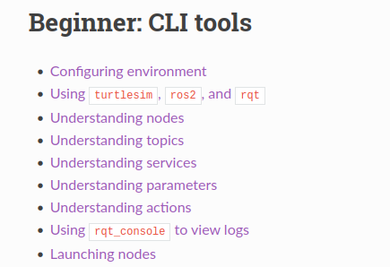
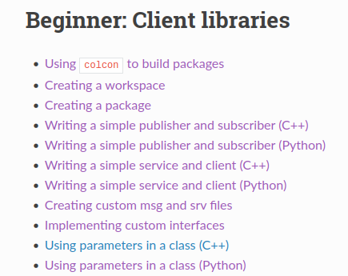
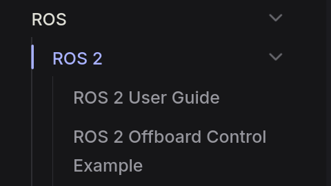
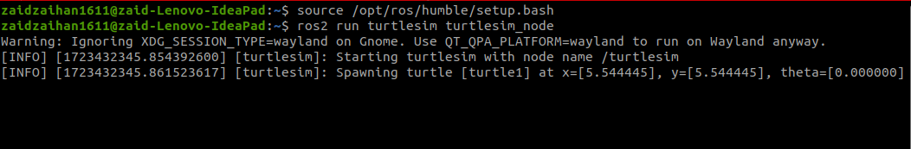
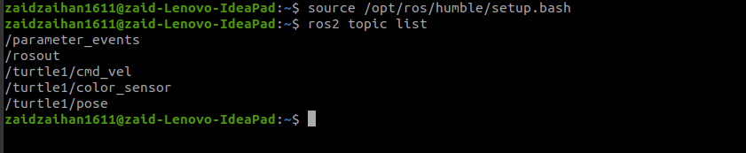
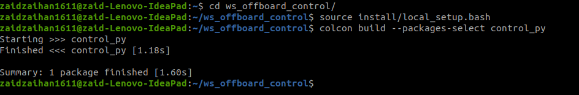
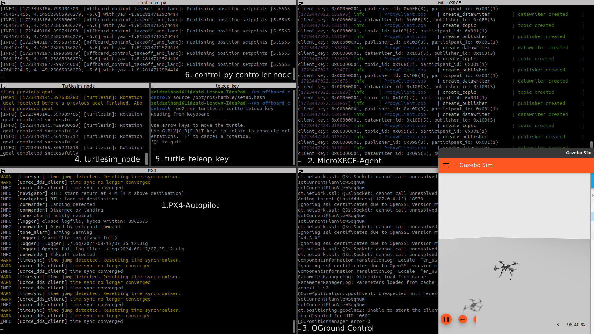
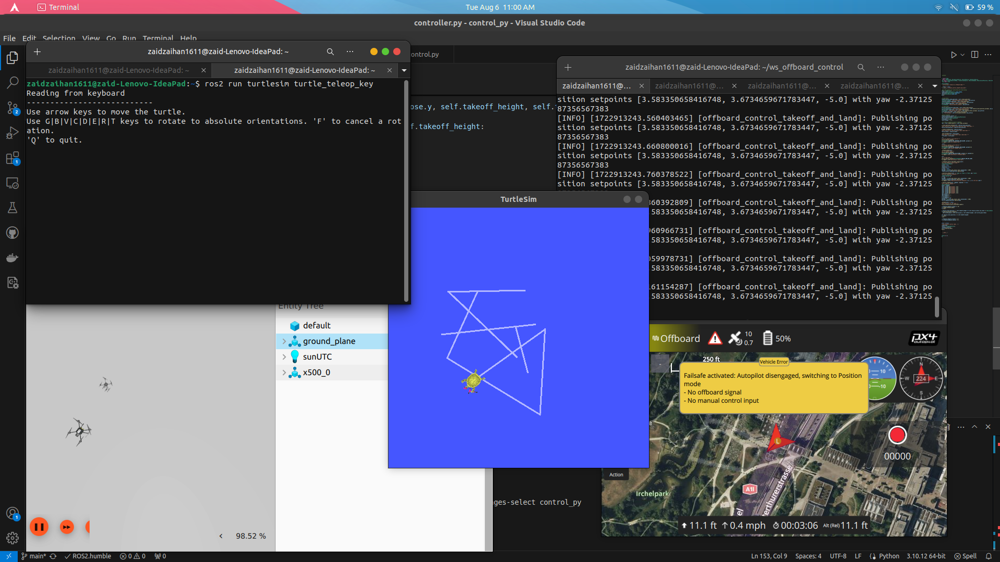

# Beginner guide to ROS 2 for PX4 development  

## This guide specifies the tasks needed to kick-start your PX4 development journeys using ROS 2

### Prerequisites

1. **Install Ubuntu 22.04 LTS (Jammy Jellyfish)**
   - Ensure your system is set up with the necessary operating system.

2. **Install ROS 2 Humble**
   - Follow the official installation guide for ROS 2 Humble.

3. **Complete ROS 2 Humble Beginner Tutorials**
   - **CLI Tools**: Familiarize yourself with basic command-line tools.
   - **Client Libraries**: Learn the basics of writing and running ROS 2 nodes using client libraries.

4. **Install QGroundControl**
   - Set up QGroundControl for UAV management and monitoring.

5. **Follow the PX4: ROS 2 User Guide**
   - Integrate ROS 2 with PX4 by following the official user guide.

6. **Set up Micro XRCE-DDS Agent and Client**
   - Install and configure the Micro XRCE-DDS communication bridge.

7. **Build and Run a ROS 2 Workspace**
   - Set up your ROS 2 workspace and ensure it is functional by building and running a sample project.

---  

### Installing Ubuntu 22.04 LTS (Jammy Jellyfish)

- Download the **Ubuntu 22.04 Desktop image** [here](https://releases.ubuntu.com/jammy/).
- It is recommended to create a [dual boot system](https://www.freecodecamp.org/news/how-to-dual-boot-windows-10-and-ubuntu-linux-dual-booting-tutorial/) and allocate **at least 100GB** for Ubuntu 22.04 OS, as PX4 can require more than 40GB after installation.

---  

### Installing ROS 2 Humble

- Follow the ROS 2 Humble installation guide [here](https://docs.ros.org/en/humble/Installation/Ubuntu-Install-Debians.html).

**Note:** Test the installation by running the [Talker-Listener example](https://docs.ros.org/en/humble/Installation/Ubuntu-Install-Debians.html#talker-listener) provided on the same page.

---  

### List of ROS 2 Beginner Tutorials

Complete both ROS 2 beginner tutorials below before proceeding, as the concepts are crucial for the next steps.

#### **1. ROS 2 Beginner: CLI Tools Guide**

- Follow the **Beginner: CLI Tools** tutorials [here](https://docs.ros.org/en/humble/Tutorials/Beginner-CLI-Tools.html).
- Start from the [**Configuring environment**](https://docs.ros.org/en/humble/Tutorials/Beginner-CLI-Tools/Configuring-ROS2-Environment.html) section and continue until [**Launching nodes**](https://docs.ros.org/en/humble/Tutorials/Beginner-CLI-Tools/Launching-Multiple-Nodes/Launching-Multiple-Nodes.html).

  

#### **2. ROS 2 Beginner: Client Libraries Guide**

- Follow the **Beginner: Client Libraries** documentation [here](https://docs.ros.org/en/humble/Tutorials/Beginner-Client-Libraries.html).
- Start from [**Using `colcon` to build packages**](https://docs.ros.org/en/humble/Tutorials/Beginner-Client-Libraries/Colcon-Tutorial.html) and continue until [**Using parameters in a class**](https://docs.ros.org/en/humble/Tutorials/Beginner-Client-Libraries/Using-Parameters-In-A-Class-Python.html).

  

**Note:** Some of the tutorials above support the use of either **Python** or **C++** for implementation. **Choose** the programming language you are **most familiar** with.

---  

### Installing and Understanding PX4 and QGC

1. Start by reading the **PX4 ROS 2** [**Introduction**](https://docs.px4.io/main/en/ros2/).

2. Follow the Official **PX4 ROS 2 guide** [**here**](https://docs.px4.io/main/en/ros2/user_guide.html) to install PX4 and set up the **Micro XRCE-DDS Agent and Client**.

    
3. Install **QGroundControl** for Ubuntu [**here**](https://docs.qgroundcontrol.com/master/en/qgc-user-guide/getting_started/download_and_install.html#ubuntu). You may read the QGC documentation on the same page.

4. Read through the guide until [**here**](https://docs.px4.io/main/en/ros2/user_guide.html#ros-2-example-applications) to understand how to **write a ROS node** to listen to topics published by PX4.

  **Note:** When following the [**guide**](https://docs.px4.io/main/en/ros2/user_guide.html), **skip** the [**Install ROS 2**](https://docs.px4.io/main/en/ros2/user_guide.html#install-ros-2) section as we have already installed it before.

- **ROS 2 Offboard Control Example**

  - Run the **ROS 2 Offboard Control Example** provided on [**this page**](https://docs.px4.io/main/en/ros2/offboard_control.html) and try experimenting with the code. Remember to run `colcon build` each time you make changes to the code to rebuild it.  
  Also dont forget to **run QGC** when trying to run the PX4 simulation.

---  

### Tasks Completion

Here are some task you should try in order to further grasp the concept of ROS 2 PX4 development.

1. **Extending turtlesim's `turtle_teleop_key` controls** to **control the drone simulation** in the ROS 2 Offboard Control Example.

2. **Creating a custom uORB topics** and using it to **send custom values** from ROS 2 to PX4.

3. **Develop Mavlink message for the custom uORB topics** and use it to **send the uORB message**. Analyze it by using WireShark to prove that the custom Mavlink is being sent.  

**It is recommended for you to try finishing the above tasks by yourself first.**  
Use the guide below only if you are stuck.

### Task 1: Extending turtlesim's turtle_teleop_key node's command to control drone simulation

#### **Instruction: Use topic from turtlesim node's topic to control the PX4 drone simulation.**

  There are two turtlesim's topic that you can use to try controlling the drone which are **turtle1/pose** and **turtle1/cmd_vel**.  

  This tutorial uses turtlesim's pose topic as it can give full control in 2D vector (x, y, theta).

  To start tinkering, we first need to see the type and the values of the messages being sent from **turtlesim_node**.  
  Open a new terminal, source the ROS 2 setup file, and run **turtlesim_node**.

  `source /opt/ros/humble/setup.bash`  
  `ros2 run turtlesim turtlesim_node`

  

  Then open a new terminal, again **source the ROS 2** setup file and run:

  `ros2 topic list`

  

  We can see, there is **/turtle1/pose** topic in the list.  
  Next, echo the values from the topic.

  `ros2 topic echo /turtle1/pose`

  We can see the variables of the topic emitted are as below:  

  `x: 5.306337833404541`  
  `y: 5.2459282875061035`  
  `theta: -1.2784440517425537`  
  `linear_velocity: 0.0`  
  `angular_velocity: 0.0`  

  End the echo by using **Ctrl+C**, and try to check the type of the topic:

  `ros2 topic list -t`

  We can see the message type of the `/turtle1/pose` topic is [**Pose**](http://docs.ros.org/en/noetic/api/turtlesim/html/msg/Pose.html):  
  _/turtle1/pose [turtlesim/msg/Pose]_

  With this information, we can **subscribe to the `/turtle1/pose` topic**, and use the values to publish and move the drone to the corresponding positions.

- Assuming you have the `~/ws_offboard_control` colcon workspace directory you created while trying the [**ROS 2 Offboard Control Example**](https://docs.px4.io/main/en/ros2/offboard_control.html) before, **open a new terminal.**  

  Note: This guide uses **Python** for the development.  
  _Visit ROS 2 humble website if you want to use C++ instead._

1. In the new terminal, source the ROS 2 setup and enter the offboard_control's src folder :  

    - `source /opt/ros/humble/setup.bash`  

    - `cd ~/ws_offboard_control/src/`

2. Create a new package and name it as **control_py**.  

    - `ros2 pkg create --build-type ament_python --license Apache-2.0 control_py`

3. Open the workspace using your preferred code editor.  

    - `code .`

4. In the **control_py** folder, setup the email, name and license in **package.xml** and **setup.py** according to the previous tutorial. (See notes below)

    **Note** : Follow this [**tutorial**](https://docs.ros.org/en/humble/Tutorials/Beginner-Client-Libraries/Creating-Your-First-ROS2-Package.html) to create a ROS 2 package if you have any problem.

5. Enter into the `control_py` folder and create a new `controller.py` python file.

    - control_py
        - controller.py

6. Copy this [**offboard_control.py**](https://github.com/PX4/px4_ros_com/blob/main/src/examples/offboard_py/offboard_control.py) code from the **ROS 2 Offboard Control example** and paste it into **controller.py**.

7. In the code editor, open the **setup.py** file, and add the following line within the console_scripts brackets of the entry_points field:  

    ```python
    ...
    entry_points={
        'console_scripts': [
            'controller = control_py.controller: main',
        ],
    },
    ...

8. Open a terminal and head to the root of the workspace and build the package to ensure that the setup is successful.  
`cd ~/ws_offboard_control`  
`colcon build --packages-select control_py`

9. Head over to the code editor, and open **controller.py**.

10. At the top of the code, import Pose message from turtlesim message:  
  `from turtlesim.msg import Pose`

11. Update the QoS profile so that it is compatible with turtlesim pose.  

      ```python
     qos_profile = QoSProfile(
            reliability=ReliabilityPolicy.BEST_EFFORT,
            durability=DurabilityPolicy.VOLATILE,
            history=HistoryPolicy.KEEP_LAST,
            depth=1
        )

12. Subscribe to the turtlesim's pose, and create a callback function called **turtle_pose_callback** at the subscription sections:

      ```python
      ...
        self.turtle_pose_subscriber = self.create_subscription(
            Pose, '/turtle1/pose', self.turtle_pose_callback, qos_profile)
      ...

13. Initialize turtle_pose variables with the Pose class:

      ```python
      ...
        self.offboard_setpoint_counter = 0
        self.vehicle_local_position = VehicleLocalPosition()
        self.vehicle_status = VehicleStatus()
        self.turtle_pose = Pose()#initialize turtle_pose structure.
        self.takeoff_height = -5.0
      ...

14. Create the turtle_pose_callback function definition:

      ```python
          def turtle_pose_callback(self, turtle_pose):
            self.turtle_pose = turtle_pose #Callback function for turtle1/pose topic subscriber.
  
15. Lastly, we can modify the timer_callback code so that instead of making the drone take off and land after reaching the set height, we can configure it to hover at a fixed height. We would then control the drone's x and y positions and yaw angle using the values obtained from the turtlesim pose. We also needs to comment the land() function from being called so that the drone will always hover.

      ```python
          def timer_callback(self) -> None:
        """Callback function for the timer."""
        self.publish_offboard_control_heartbeat_signal()

        if self.offboard_setpoint_counter == 10:
            self.engage_offboard_mode()
            self.arm()

        if self.vehicle_local_position.z > self.takeoff_height and self.vehicle_status.nav_state == VehicleStatus.NAVIGATION_STATE_OFFBOARD:
            self.publish_position_setpoint(
                self.turtle_pose.x, self.turtle_pose.y, self.takeoff_height, self.turtle_pose.theta)

        #elif self.vehicle_local_position.z <= self.takeoff_height:
            #self.land()
            #exit(0)

        if self.offboard_setpoint_counter < 11:
            self.offboard_setpoint_counter += 1

16. Save the code, and build the package using `colcon build`. Make sure you are in the root folder of the workspace, outside the src folder.

    `colcon build --packages-select control_py`

    

17. If the build succeeds, open a new terminal and navigate to the **ws_offboard_control** workspace.

    `cd ~/ws_offboard_control`

18. Then source the local setup.

    `source install/setup.bash`

19. Before running the control_py controller package, we need to run PX4 simulation, MicroXRCE-DDS Agent, turtle_teleop_key, QGC and turtlesim_node.  
    1. To run PX4 simulation, open a new terminal, enter into the PX4-Autopilot folder

        `cd ~/PX4-Autopilot`

          and run:

        `make px4_sitl gz_x500`

    2. To run MicroXRCE, open a new terminal and head over to Micro-XRCE-DDS-Agent folder

        `cd Micro-XRCE-DDS-Agent/`  

        and run:
  
        `MicroXRCEAgent udp4 -p 8888`

    3. To run QGC, **head over to the folder** in which the application image is in, and run:

        `./QGroundControl.AppImage`

20. Open two new terminal and **source the ROS 2 workspace** in each terminal,  

      `source /opt/ros/humble/setup.bash`

       and in the first terminal run:  

      `ros2 run turtlesim turtlesim_node`

      and for the second terminal run:

      `ros2 run turtlesim turtle_teleop_key`

    - For reference, here is all the required tools and ROS 2 nodes needed to be run:

    

21. Now head over to the first terminal that is in the ws_offboard_control workspace, and run the executables from the package we created earlier.

      `ros2 run control_py controller`

22. The drone in the PX4's Gazebo simulation should now start arming and takeoff until our set height. Now, head over to the turtle_teleop_key terminal and try to control the drone using the arrow key. You can also control the yaw of the drone by using G|B|V|C|D|E|R|T keys.



_The image shows the drone simulation view from above. The drone's position moves according to the `turtle_teleop_key` controller, using values from the `turtle1/pose` topic in the turtlesim simulation. The drone's movement mirrors the turtle's movement in the turtlesim simulation._

### Task 2: Creating a custom uORB topics and using it to send custom values from ROS 2 to PX4

Instruction: Create custom uORB messages that can receive message from turtle1/pose topic and displays it into PX4 shell/terminal or QGC Mavlink console.

Briefing:  

- Start by reading through PX4 official **middleware documentation**: <https://docs.px4.io/main/en/middleware/uorb.html>  

- Focus on the [Adding a new topic](https://docs.px4.io/main/en/middleware/uorb.html#adding-a-new-topic) section.

Step by step:
